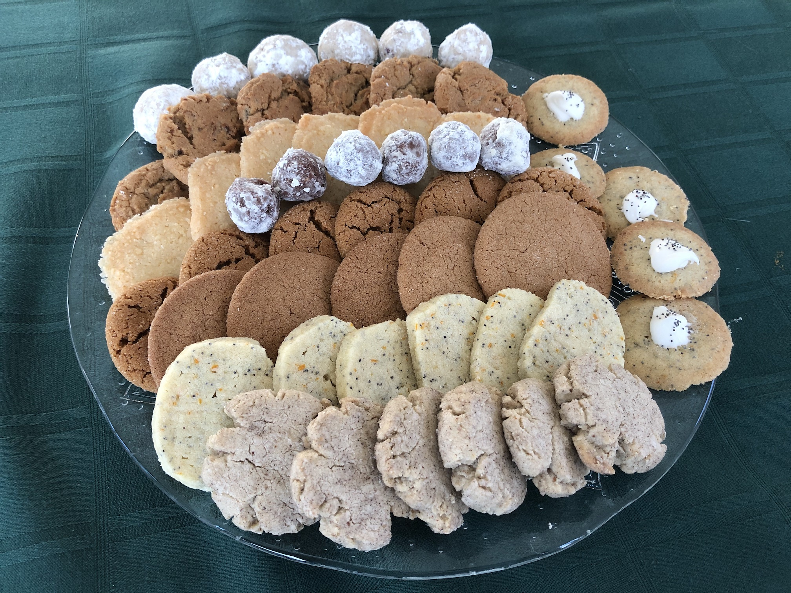

# Cookies

These are most of our standard Christmas cookies.  The frosted cookies along the
side are [Hungarian Allspice Poppyseed Wafers](Hungarian%20Allspice%20Poppyseed%20Wafers.md)
(which aren't supposed to be so flat; this batch didn't have enough flour).  The
other cookies are, from front to back:

- [Cardamom Butter Balls](Cardamom%20Butter%20Balls.md)
- [Poppyseed Cookies](Poppyseed%20Cookies.md)
- [Brown Sugar Nutmeg Snaps](Brown%20Sugar%20Nutmeg%20Snaps.md)
- [Molasses Sugar Cookies](Molasses%20Sugar%20Cookies.md)
- [Bourbon Balls](Bourbon%20Balls.md)
- [Norwegian Coin Cakes](Norwegian%20Coin%20Cakes.md)
- [Ground Raisin Cookies](Ground%20Raisin%20Cookies.md)
- [Snowballs](Snowballs.md)

## General Cookie Information

Most cookie recipes follow a standard pattern:

1. Mix your dry powders in a secondary bowl.
2. Beat your wet ingredients in the main bowl.
3. Mix in the dry ingredients from step one.
4. Mix in the chunky ingredients, if any.
5. Roll into balls, if required.
6. Bake and cool.

After baking,  let the cookies cool for about five minutes  on the cookie sheet,
then move to a rack or some other surface to cool fully (we use an old griddle).
If you try to move the cookies too early they'll still be soft and you'll squish
them; if you try to move them too late some varieties will get stuck to the pan.

These recipes all assume your oven is pre-heated to the correct temperature.
